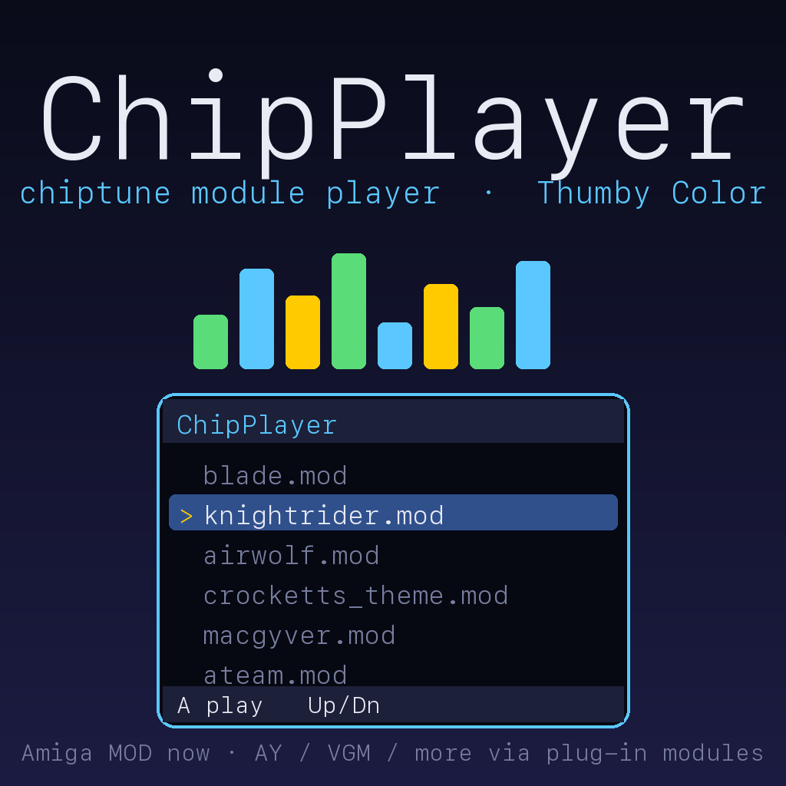

# ChipPlayer — a chiptune module player for Thumby Color

Browse and play tracker/chip music **on the device itself**. ChipPlayer streams
real audio out the Thumby Color's buzzer with a software mixer — no desktop needed.

Today it plays **Amiga ProTracker `.mod`** files (4/6/8 channel). It's built as a
**pluggable player**: new chiptune formats (AY/YM, VGM, NES, …) drop in as small
modules behind one shared audio engine, so they share the output stage and UI
instead of each being its own app.



## Controls

| Button | In the browser | While playing |
|--------|----------------|---------------|
| **Up / Down** | move selection | — |
| **A** | play the selected module | — |
| **B** | — | stop, back to the list |

When a track finishes it **auto-advances** to the next module in the list; press
**B** at any time to stop and go back to the browser. The "Now Playing" screen shows
the module title, channel count / sample rate, a **`elapsed / total` time** readout,
and a progress bar. (MOD files store no duration, so the total is computed at load
by a quick silent pass through the song, with loop detection.)

## Adding your own music

ChipPlayer ships with a small original demo module (`songs/chipdemo.mod`). Add more
by copying `.mod` files into the **`/Music`** folder on the device (via
[the Thumby Color IDE](https://color.thumby.us/code/) file browser, or `mpremote`):

```bash
mpremote connect <port> fs cp mysong.mod :/Music/mysong.mod
```

ChipPlayer lists everything in `/Music` with a supported extension and detects the
real format by its header bytes (so a mis-named file still works, and unsupported
formats are simply skipped).

### Where to find `.mod` files

- **The Mod Archive** — https://modarchive.org/ (huge, searchable, legal to download)
- **Aminet mods** — https://aminet.net/tree?path=mods
- **Modland** — https://www.exotica.org.uk/wiki/Modland
- **UnExoticA** (Amiga game/demo music) — https://www.exotica.org.uk/wiki/UnExoticA

Keep files reasonably small. Lean mode keeps the whole module resident in RAM, so
modules up to **~200 KB** play comfortably; very large ones (300 KB+, or long
multi-pattern epics) can exceed the Thumby's ~half-MB of RAM and won't load.

## How it works

```
main.py            browser + transport UI (engine draw/input) and the audio pump
formats/mod.py     MOD format: sequencer + mixer (the "player")
formats/mod_parser.py  MOD file parser (headers, patterns, samples)
```

- **Display / input** use the stock engine: draw into `engine_draw.back_fb_data()`
  (wrapped in a `framebuf.FrameBuffer`, re-grabbed every frame because the engine
  double-buffers), read `engine_io.*.is_just_pressed`, present with `engine.tick()`.
- **Audio output** is PWM on GPIO 23 (120 kHz carrier, 16-bit duty centered at
  32768) — the same DAC path the system uses. A `@micropython.viper` mixer fills
  each sample and writes the duty, paced by `time.ticks_us()`.
- **MOD playback** runs the sequencer one *tick* at a time (rows, effects, tempo)
  in Python, then the viper mixer renders that tick's worth of samples. Between
  ticks the UI polls input, so **B** stops promptly.
- **Low RAM ("lean") mode**: instead of expanding every pattern into objects and
  copying a sample pool, the player reads note data on the fly from the file buffer
  and the mixer reads sample PCM straight from those same bytes. A 90 KB module
  loads with >200 KB RAM free.

### MOD effects implemented

Arpeggio `0xy`, portamento up/down `1xx`/`2xx`, tone portamento `3xx`, vibrato
`4xx`, tremolo `7xx`, tone-porta+slide `5xx`, vibrato+slide `6xx`, sample offset
`9xx`, volume slide `Axy`, set volume `Cxx`, position jump `Bxx`, pattern break
`Dxx`, set speed/tempo `Fxx`. (Finetune, glissable slides and `Exx` extended
commands are not yet handled.)

## Adding a new chiptune format

The design goal: **one output engine + UI, many format modules.** A format module is
the *producer* of PCM; the engine is the *consumer*.

**1. Write `formats/<fmt>.py`** exposing this minimal contract:

```python
class Player:
    def load(self, buf):        # parse the file bytes; raise on bad data
        ...
        self.meta = {'title': ..., 'channels': ..., 'order_len': ...}
        self.done = False

    def render(self, out, n):   # fill out[0:n] with signed-16 mono PCM, return n
        ...                     # set self.done = True at end of song
        return n
```

`render(out, n)` is the whole interface: the engine hands you an `array('h')` buffer
to fill each block, whatever your synthesis is — mixing samples (MOD/XM), running a
square/noise/envelope chip (AY/SN76489), or replaying a register log (VGM). For
on-device real-time performance, write the inner per-sample loop with
`@micropython.viper` (see `mod.py` and `main.py`'s `mix_out`). A pure-Python
`render()` is fine for host-side rendering and testing.

**2. Register its magic bytes** in `main.py`'s `detect_format()`:

```python
if head[:4] == b'Vgm ':
    return 'VGM'
```

and map that tag to your module where formats are dispatched.

**3. Test on the host** without hardware — render to a WAV and listen:

```bash
python3 host/render_wav.py mysong.mod out.wav 60 22050
```

(For a non-MOD format, add a small host driver that calls your `Player.render`.)

### Format roadmap

Easiest first (all just become PCM out the buzzer; difficulty = synthesis):

1. **Sample trackers** — MOD (done), then **XM / S3M / IT** (same mixer, more
   channels/envelopes).
2. **Register-log / simple chips** via **VGM**: AY-3-8910 / YM2149 (`.YM`,
   3 square + noise + envelope — very easy), SN76489, Game Boy DMG, NES 2A03.
3. **CPU-driven** (need a CPU emulator + the chip): NSF, GBS, and — hardest — SID.

The buzzer is mono, so multi-channel formats mix down to one output.

## Credits & license

ChipPlayer engine and MOD player: **zebtron**, 2026. MIT-style — do what you like,
no warranty. Module files are **not** included; they belong to their composers —
download from the archives linked above.
